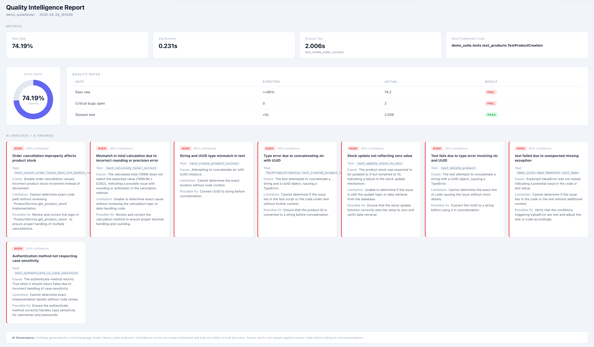

# Quality Intelligence Tool

A CLI that analyzes pytest test suites using local AI models and generates an HTML dashboard with root cause analysis, quality metrics, and AI governance built in.

**Stack:** Python · Ollama · LangGraph · Jinja2 · Chart.js



---

## What it does

You point it at a JUnit XML test output and a bug report CSV, and it produces a self-contained HTML report with:

- **Metrics** — pass rate, average runtime, slowest test, most problematic suite
- **Quality Gates** — configurable thresholds evaluated deterministically (no AI guessing)
- **AI Analysis** — per-failure root cause analysis with severity and confidence scores
- **AI Governance** — explicit limitations section; confidence scores are model-estimated, not facts

The AI runs fully locally via Ollama — no API keys, no internet connection required (except for the Pie chart library loaded from CDN).

---

## Architecture

```
pytest run → JUnit XML ─┐
                         ├─► LangGraph pipeline ─► HTML report
bug report CSV ──────────┘

LangGraph nodes:
  xml_parser   csv_parser      (parallel)
       └──────────┘
            ↓
  metrics   quality_gates      (parallel)
       └──────────┘
            ↓
       ai_analyzer             (Ollama — one call per failure)
            ↓
          output
```

The split between deterministic and AI analysis is intentional: quality gates never hallucinate, AI findings always declare their confidence.

---

## Prerequisites

- Python 3.14+
- [uv](https://docs.astral.sh/uv/) (package manager)
- [Ollama](https://ollama.com/) installed and running

---

## Setup

```bash
git clone <repo-url>
cd ai-test-reviewer

# Install dependencies
uv sync

# Pull the AI model (this downloads ~9GB — grab a coffee)
ollama pull deepseek-r1:14b
```

---

## Generate the test data

The repo includes a demo e-commerce suite with 6 intentional bugs across products, orders, and users. Run it to generate the XML input:

```bash
uv run pytest demo_suite/tests/ --junit-xml=data/test_run.xml -v
```

The `data/bugs.csv` file is already included — it contains 10 bug reports in Jira-like format.

---

## Run the pipeline

```bash
uv run python main.py --input-xml data/test_run.xml --input-bug-list data/bugs.csv
```

Optional: use `--output <dir>` to save the report to a different directory (default: `reports/`).

The report is saved to `<output>/test_analysis_YYYY-MM-DD_HHMMSS.html`. Open it in any browser.

**First run takes 3–5 minutes** (the model analyzes each failure separately). After that, use `--rebuild` to re-render the report from cached data without calling the model again:

```bash
uv run python main.py --rebuild
```

---

## Intentional bugs in the demo suite

The demo suite exists to give the AI something real to analyze:

| Bug | File | Description | Tests affected |
|-----|------|-------------|----------------|
| A | `products.py` | `'prd-' + uuid.uuid4()` — UUID is not a string | 3 FAIL |
| B | `products.py` | `if stock else` — falsy check fails when stock = 0 | 1 FAIL |
| C | `orders.py` | `cancel_order` with no state guard — double cancel inflates stock | 1 FAIL |
| D | `orders.py` | `int(total)` truncates decimals — 9.99 × 2 = 19, not 19.98 | 1 FAIL |
| E | `users.py` | `.lower()` on both passwords — auth becomes case-insensitive | 1 FAIL |
| F | `users.py` | No duplicate email check — two accounts can share an email | 1 FAIL |

---

## Learning journey

This project was built as a structured learning exercise, not just to have something to show.

**The constraint:** each phase could only use what the previous phase taught. No frameworks before understanding what they abstract.

### Phase 1 — Understanding the data before touching AI

Before writing a single prompt, I spent time with the test output: what does a JUnit XML actually contain? What does a failure look like structurally? Writing the parsers by hand (`xml_parser.py`, `csv_parser.py`) forced me to answer those questions concretely.

**What I learned:** clean input parsing is 80% of the work in any data pipeline. The AI is only as good as the structure you feed it.

### Phase 2 — Direct Ollama calls, no framework

The first AI integration was a raw HTTP request to Ollama — no LangChain, no SDK. One prompt, one response, parse the result.

**What I learned:** a language model is just an HTTP endpoint. Understanding that demystified every abstraction built on top of it. I also learned about prompt sensitivity: the same failure analyzed twice by the same model can produce different outputs, which is why confidence scores matter.

### Phase 3 — LangGraph

Once I understood what the model did alone, adding LangGraph made sense. I learned how state flows through a graph, how parallel edges work, and hit a real bug: adding an edge from `csv_parser` directly to `quality_gates` caused a race condition because the state wasn't complete yet. Fixing it taught me that in LangGraph, edges control flow but the state is what carries data — they're separate concerns.

**What I learned:** frameworks exist to solve problems you've already encountered. Learning them before the problem makes them feel like magic; learning them after makes them feel like tools.

### Phase 4 — HTML reporting with Jinja2

The final layer was turning structured data into something a non-technical stakeholder could read. Switching from f-strings to Jinja2 templates separated the rendering logic from the data logic cleanly.

I also changed the AI output format mid-project: the model was originally returning markdown, which required regex parsing and was fragile. Switching the system prompt to request JSON and extracting it with a small regex (`re.search(r'\{.*\}', text, re.DOTALL)`) made the pipeline significantly more reliable.

**What I learned:** output format is part of the contract with the model. Treating it as an afterthought causes pain downstream.

---

## What this project demonstrates

- Building a real AI pipeline from scratch, not wrapping an existing one
- Separating deterministic logic (metrics, quality gates) from probabilistic logic (AI analysis)
- AI governance in practice: confidence scores, explicit limitations, no silent failures
- LangGraph for multi-node orchestration with shared state
- Working with local models via Ollama — no API dependency, no cost per run
- Iterative design: the architecture evolved as understanding deepened, not all at once

---

## Project status

| Phase | Status | Description |
|-------|--------|-------------|
| 0 | Done | Repo setup |
| 1 | Done | Demo test suite with intentional bugs |
| 2 | Done | Ollama integration + deterministic analyzers |
| 3 | Done | LangGraph pipeline (6 nodes) |
| 4 | Done | HTML report with Jinja2 + Chart.js |
| 5 | Planned in a future update | Self-healing prototype |
